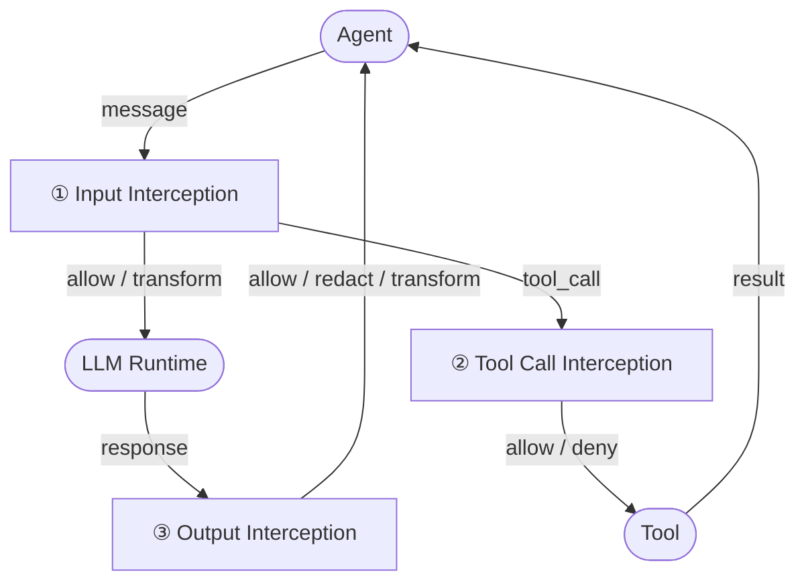

# Core Concepts

**Status: DRAFT**

## 1. Purpose

APS defines a standard interception layer between an AI agent and its underlying LLM. It enables operators and developers to express, evaluate, and enforce policies on every interaction — independently of the agent framework or LLM provider in use.

## 2. Terminology

| Term | Definition |
|---|---|
| **Agent** | A system that uses an LLM to reason and act, typically by invoking tools or producing outputs |
| **LLM Runtime** | The underlying model or API that processes messages and produces responses |
| **APS Runtime** | A compliant implementation of this specification that sits between the agent and the LLM runtime |
| **Policy** | A rule or set of rules that governs what is allowed at an interception point |
| **Policy Decision** | The result of evaluating a policy against an input: `allow`, `deny`, `redact`, `transform`, or `audit` |
| **Interception Point** | One of three defined moments in the interaction lifecycle where policies are evaluated |

## 3. Interaction Lifecycle

APS defines three interception points:



### 3.1 Input Interception

Occurs when the agent sends a message (or message history) to the LLM. The APS runtime evaluates the message payload against input policies before it is forwarded.

### 3.2 Tool Call Interception

Occurs when the LLM produces a tool call instruction. The APS runtime evaluates the tool name, arguments, and calling context against tool call policies before the tool is executed.

### 3.3 Output Interception

Occurs when the LLM produces a response. The APS runtime evaluates the response payload against output policies before it is returned to the agent.

## 4. Data Model

### 4.1 InputContext

```json
{
  "messages": [
    { "role": "system" | "user" | "assistant", "content": "string" }
  ],
  "metadata": {
    "agent_id": "string",
    "session_id": "string",
    "timestamp": "ISO 8601"
  }
}
```

### 4.2 ToolCallContext

```json
{
  "tool_name": "string",
  "arguments": {},
  "calling_message": { "role": "assistant", "content": "string" },
  "metadata": {
    "agent_id": "string",
    "session_id": "string",
    "timestamp": "ISO 8601"
  }
}
```

### 4.3 OutputContext

```json
{
  "response": { "role": "assistant", "content": "string" },
  "metadata": {
    "agent_id": "string",
    "session_id": "string",
    "timestamp": "ISO 8601"
  }
}
```

## 5. Policy Decision

Every policy evaluation MUST produce one of the following decisions:

| Decision | Meaning |
|---|---|
| `allow` | The interaction proceeds unchanged |
| `deny` | The interaction is blocked; the agent receives an error or configured fallback |
| `redact` | Specific content is removed or masked before the interaction proceeds |
| `transform` | The payload is modified before the interaction proceeds |
| `audit` | The interaction proceeds, but is logged for review |

Decisions are not mutually exclusive. A policy MAY produce `audit` alongside any other decision.
